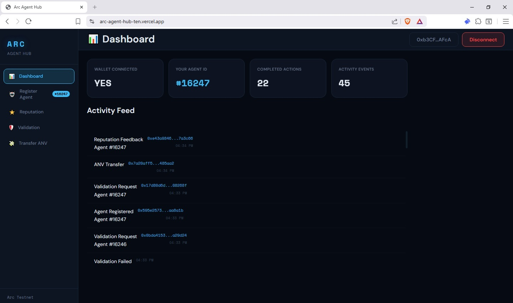
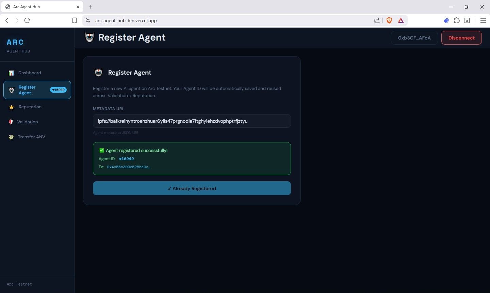
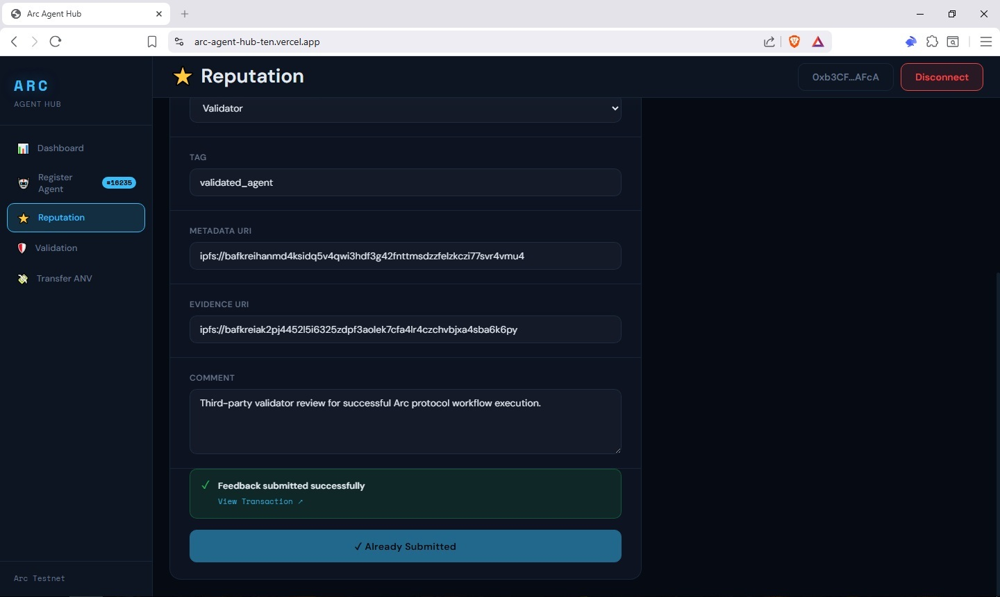
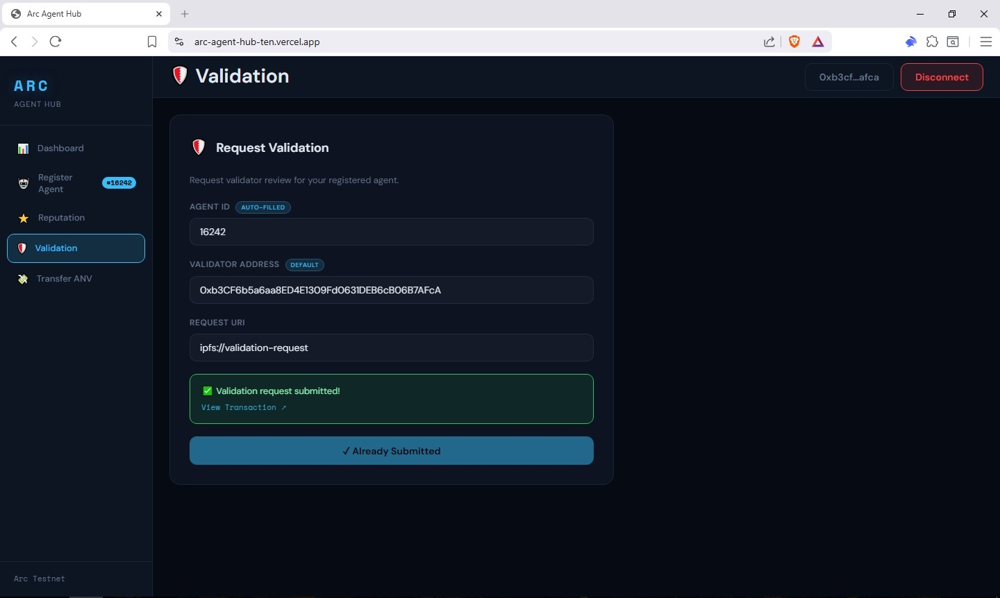

# 🚀 Built on Arc Testnet

## Arc Agent Hub

Arc Agent Hub is a Trusted AI Agent Operations Dashboard built on Arc Testnet to enable verifiable, reputation-based, and identity-aware AI agents.

### 🌐 Live Demo

https://arc-agent-hub-ten.vercel.app/

### 💻 GitHub Repository

https://github.com/Jaehaerysp/arc-agent-hub

---

## 🎯 Project Vision

Arc Agent Hub combines AI agents, blockchain identity, reputation systems, and validation workflows to create trusted autonomous systems for real-world applications.

The platform allows users to register AI agents, verify ownership, manage metadata, track reputation, and validate agent activities using Arc's onchain infrastructure.

---

## ⚡ Core Features

### Agent Registration

* ERC-8004 compatible AI Agent registration
* Onchain ownership verification
* Agent metadata management

### Identity Integration

* Connected to Arc Identity Registry
* Agent identity verification
* Trusted ownership records

### Reputation System

* Arc Reputation Registry integration
* Reputation score tracking
* Trust-based agent evaluation

### Validation Workflows

* Arc Validation Registry integration
* Agent verification process
* Onchain validation records

### IPFS Storage

* Decentralized metadata storage
* Agent profile hosting
* Immutable records

### Multi-Wallet Support

* MetaMask integration
* WalletConnect support
* Testnet wallet interactions

---

## 🏗 Arc Official Contract Integrations

### Identity Registry

0x8004A818BFB912233c491871b3d84c89A494BD9e

### Reputation Registry

0x8004B663056A597Dffe9eCcC1965A193B7388713

### Validation Registry

0x8004Cb1BF31DAf7788923b405b754f57acEB4272

---

## 🪙 ERC20 Tokens Deployed

| Token |
| ----- |
| ANV   |
| BPK   |
| CRP   |
| DTC   |
| EVM   |
| FLX   |
| GLD   |
| HVT   |
| NVS   |
| ZNP   |

---

## 📦 Distributor Contracts

* 0xf1ac0F50ba92D6BeAA450b500356177e2d4DA2D6
* 0x92683E0fDc27D470E1c19B96C0539193b539bc63
* 0x2063efEe5f013273BA4A18644FAA34f00d983eCB
* 0x4Ec99C8880002EaFDfC3764CC34f14D4a32a3615
* 0xA58Be676069cC7809bC0189a6D47F0F0C0cae4e7
* 0x84939a3a61B37db3c46c5dE954000036624A1E5C
* 0xAB46322F9631AC38F5ceBe40A055b29e6fC88078
* 0x19DccEE61c22c68F1795dffdEaB56717a462151e
* 0xdF6f483EFdFBFDDa636634Ab5430343646a59459
* 0x0C5C8707Eb4D8fefd54D93b08a4fbb880af0B76c

---

## 🛠 Technology Stack

* Solidity
* TypeScript
* React
* Next.js
* ethers.js
* IPFS
* Arc Testnet

---

## 📸 Screenshots

Add screenshots here:

### Dashboard

### Agent Registration

### Reputation System

### Validation Workflow

---

## 🚀 Future Roadmap

* AI Agent Marketplace
* Reputation Analytics Dashboard
* Scam Detection Engine
* Agent Monitoring System
* Cross-chain Agent Identity
* Enterprise Agent Verification

---

## 🤝 Arc Ecosystem Contribution

This project was built to explore how Arc's identity, reputation, validation, and stablecoin infrastructure can support trusted AI systems and practical real-world applications.

I am actively contributing to the Arc ecosystem through development, testing, community participation, and builder feedback.
